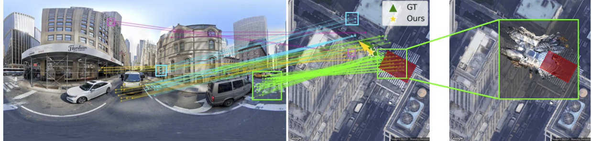

# [ICLR'26] Loc<sup>2</sup>: Interpretable Cross-View Localization via Depth-Lifted Local Feature Matching
[[`Arxiv`](https://arxiv.org/pdf/2509.09792)][[`BibTeX`](#citation)]



## 📝 Abstract
We propose an accurate and interpretable fine-grained cross-view localization method that estimates the 3 Degrees of Freedom (DoF) pose of a ground-level image by matching its local features with a reference aerial image. Unlike prior approaches that rely on global descriptors or bird's-eye-view (BEV) transformations, our method directly learns ground-aerial image-plane correspondences using weak supervision from camera poses. The matched ground points are lifted into BEV space with monocular depth predictions, and scale-aware Procrustes alignment is then applied to estimate camera rotation, translation, and optionally the scale between relative depth and the aerial metric space. This formulation is lightweight, end-to-end trainable, and requires no pixel-level annotations. Experiments show state-of-the-art accuracy in challenging scenarios such as cross-area testing and unknown orientation. Furthermore, our method offers strong interpretability: correspondence quality directly reflects localization accuracy and enables outlier rejection via RANSAC, while overlaying the re-scaled ground layout on the aerial image provides an intuitive visual cue of localization performance.

## 📦 Checkpoints
📁 [**Download pretrained models**](https://drive.google.com/drive/folders/1JQHSxN-IRViKdFri2m9JtLMR_JdFLBIO)

## 🛠️ Installation
```bash
conda create -n loc2 python=3.10
conda activate loc2
pip install -r requirements.txt
```
> *Note: The code is tested with PyTorch 2.3.1, CUDA 11.8, and xformers 0.0.26 on NVIDIA A100/H100 GPUs.*

## 🗂️ Data Preparation

### VIGOR
Please download and prepare the VIGOR dataset by following the instructions in the [official repository](https://github.com/Jeff-Zilence/VIGOR/blob/main/data/DATASET.md).

To generate metric depth maps for the VIGOR dataset (for both training and evaluation):
```bash
python preprocess/infer_depth_vigor.py --input <VIGOR_PATH>/<CITY_NAME>/panorama --output <VIGOR_PATH>/<CITY_NAME>/unik3d_depth --save
```

### KITTI
Please download and organize the KITTI dataset according to the directory structure used in [HighlyAccurate](https://github.com/YujiaoShi/HighlyAccurate).

## 📊 Evaluation

Run all commands from the repository root.

### VIGOR

```bash
python eval_vigor.py --area <samearea|crossarea> --random_orientation <0|180> --ransac True --model_path <checkpoint>
```

Checkpoints:
- `checkpoints/vigor/samearea/known_ori/model.pt`
- `checkpoints/vigor/samearea/unknown_ori/model.pt`
- `checkpoints/vigor/crossarea/known_ori/model.pt`
- `checkpoints/vigor/crossarea/unknown_ori/model.pt`

### KITTI

```bash
python eval_kitti.py --rotation_range <10|180> --max_depth 40 --model_path <checkpoint>
```

Checkpoints:
- `checkpoints/kitti/ori_noise10/model.pt`
- `checkpoints/kitti/ori_noise180/model.pt`

### Output

Evaluation results are saved to `results/` by default. Use `--results_dir /path/to/output_dir` to override it.

## 🚀 Training

### VIGOR

```bash
python train_vigor.py --area <samearea|crossarea> --random_orientation <0|180>
```

Optional arguments:
- `--batch_size` (default: `80`)
- `--learning_rate` (default: `1e-4`)
- `--max_depth` (default: `35`)
- `--beta` (default: `1.0`)
- `--loss_grid_size` (default: `5.0`)
- `--temperature` (default: `0.1`)
- `--epoch_to_resume` to resume training

Training checkpoints are saved to `../checkpoints/` and metrics are saved to `../results/`.

## ✅ To-Do

- [x] Initial repo structure
- [x] Evaluation pipeline
- [x] Pretrained checkpoints
- [ ] Training scripts
- [ ] Visualization tools

## Citation
```bibtex
@inproceedings{xia2026loc,
  title={{Loc}$^2$: Interpretable Cross-View Localization via Depth-Lifted Local Feature Matching},
  author={Xia, Zimin and Xu, Chenghao and Alahi, Alexandre},
  booktitle={The Fourteenth International Conference on Learning Representations},
  year={2026}
}
```
